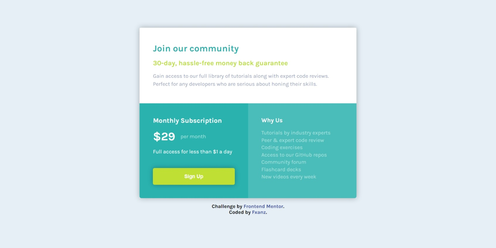

# Frontend Mentor - Single price grid component solution

## Table of contents

- [Overview](#overview)
  - [The challenge](#the-challenge)
  - [Screenshot](#screenshot)
  - [Links](#links)
- [My process](#my-process)
  - [Built with](#built-with)
  - [What I learned](#what-i-learned)
  - [Continued development](#continued-development)
  - [Useful resources](#useful-resources)
- [Author](#author)

## Overview

### The challenge

Users should be able to:

- View the optimal layout for the component depending on their device's screen size
- See a hover state on desktop for the Sign Up call-to-action

### Screenshot



### Links

- Solution URL: [Add solution URL here](https://www.frontendmentor.io/solutions/single-price-component-using-css-grid-cvNZeGgr5R)
- Live Site URL: [Add live site URL here](https://fxanz.github.io/Frontendmentor-Single-Price-Grid-Component/)

## My process

### Built with

- Semantic HTML5 markup
- CSS custom properties
- Flexbox
- CSS Grid

### What I learned

have a better understanding of blocks in HTML, have an understanding of when to use a good div

```html
<div class="card1"></div>

<div class="wrapper">
  <div class="card2"></div>
  <div class="card3"></div>
</div>
```

have a better understanding of responsive website

```css
@media screen and (max-width: 640px) {
  /* CSS TAG */
}
```

### Continued development

i will try to learn more about responsive website and flexbox on real projects

### Useful resources

- [CSS Generator](https://cssgenerator.org/box-shadow-css-generator.html) - This website help me to create box shadow more easy

## Author

- Frontend Mentor - [@fxanz](https://www.frontendmentor.io/profile/fxanz)
- Twitter - [@IFxanz](https://twitter.com/IFxanz)
